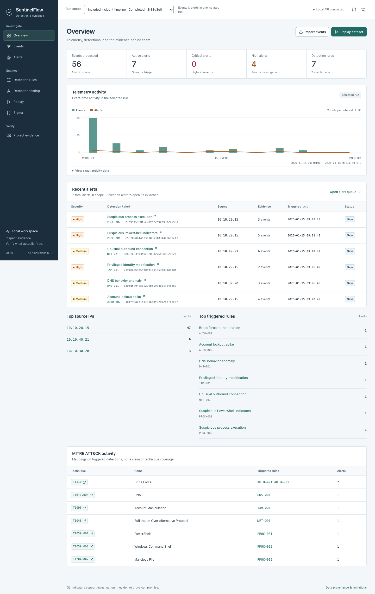
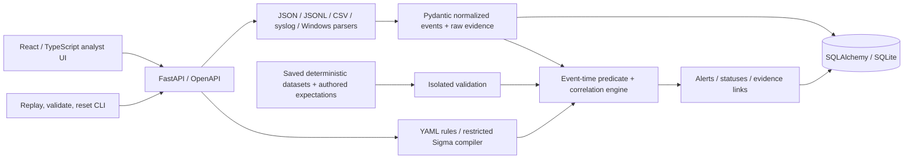

# SentinelFlow

**Local detection engineering, with an evidence trail.**

SentinelFlow is a security analytics portfolio application built around a real
event pipeline, configurable YAML detections, and reproducible validation.
It runs on your workstation without a cloud account, paid API, or external
security platform. It is **not a production SIEM**.



## Run locally

Requirements: **Python 3.11+**, **Node 20.19.2+**, and npm. Development and validation
were exercised on macOS; the commands also target Linux. Dependencies are pinned
in `requirements.lock` (including hashes) and `frontend/package-lock.json`.

```sh
make install
make validate
.venv/bin/python scripts/demo_reset.py --offline --seed
make dev
```

Open **http://127.0.0.1:5173**. The API is at
**http://127.0.0.1:8765**, with offline OpenAPI documentation at **/docs**.
`make dev` checks both ports and never terminates an existing process. To use
different ports, set `SENTINEL_BACKEND_PORT` and `SENTINEL_FRONTEND_PORT` before
starting it. See `.env.example`; secrets belong only in an untracked `.env`.

```sh
SENTINEL_BACKEND_PORT=8766 SENTINEL_FRONTEND_PORT=5174 make dev
```

Without an explicit `SENTINEL_ALLOWED_ORIGINS`, the allowed development origins
follow `SENTINEL_FRONTEND_PORT`. If you copied `.env.example`, update or remove
its explicit 5173 origin override when changing ports. CLI commands accept
`--api http://127.0.0.1:8766`; browser scripts use `SENTINEL_API_URL` and
`SENTINEL_UI_URL`. Do not accidentally reset another running instance.

Without Make:

```sh
python3 scripts/manage.py install
python3 scripts/manage.py validate
.venv/bin/python scripts/demo_reset.py --offline --seed
python3 scripts/manage.py dev
```

`manage.py` also accepts `test`, `lint`, and `format`. After installation, the
core app, tests, datasets, replay, validation, and OpenAPI assets work offline.
Only the optional public-source reproduction scripts and initial dependency /
browser installation use the network.

For a single production-build preview process:

```sh
npm --prefix frontend run build
.venv/bin/python -m uvicorn app.main:app --host 127.0.0.1 --port 8765
```

Open http://127.0.0.1:8765 with a browser. JSON API clients can use `/api/events`,
`/api/alerts`, etc.; the documented unprefixed API routes also accept JSON
requests. HTML navigation serves the SPA without colliding with `/api`.

## What it does

- Normalize JSON, JSONL, CSV, authentication syslog, and Windows-style JSON into
  one nested event model. Preserve original field values and linked raw evidence.
- Evaluate nine predicate operators, nested AND/OR/NOT, inclusive event-time
  windows, thresholds, groups, and deterministic suppression using YAML rules.
- Investigate an alert through its pinned rule definition, exact contributing
  events, source/affected entities, event-time bounds, and raw records.
- Search event fields and time ranges; manage alert statuses and rule enablement.
- Replay included telemetry instantly, at real time, or at 10x, with real progress,
  cancellation, detections, and persisted evidence.
- Compare expected and observed rule IDs, severity, branch, and evidence counts
  in isolated positive, controlled-benign, mixed, boundary, and regression scenarios.
- Compile, import, and test a documented Sigma subset, including two unchanged,
  licensed upstream rules with author attribution on resulting alerts.
- Inspect actual dashboard metrics, measured benchmark output, validation receipts,
  dataset provenance, and the included repository content.

## Architecture



A modular monolith, not microservices. SQLAlchemy separates persistence from
the engine; SQLite is the zero-configuration default. See
[architecture](docs/architecture.md) and [data model](docs/data-model.md).

## Included detections

| ID | Detection / default policy | Severity | ATT&CK mapping |
|---|---|---|---|
| AUTH-001 | 10 failed logins per source in 300 seconds, including multiple users | High | T1110 |
| AUTH-002 | 3 account lockouts per host in 300 seconds | Medium | T1110 |
| PROC-001 | PowerShell encoding, download, or dynamic-execution indicators | High | T1059.001 |
| IAM-001 | Privileged membership / identity changes outside narrow maintenance policy | High | T1098 |
| PROC-002 | Office-to-interpreter relationships and configurable command patterns | High | T1059.003, T1204.002 |
| DNS-001 | Long labels, repeated entropy heuristics, or 20 queries/source/minute | Medium | T1071.004 |
| NET-001 | 3 connections in 120 seconds to configured unusual destination ports | Medium | T1048 |

These are **indicators for investigation**, not proof of compromise, tunneling,
exfiltration, or technique coverage. Legitimate installers can match PowerShell
rules. DNS bursts and service-discovery names can match DNS rules. Policy and
controlled-benign exceptions are explained in
[detection-engine.md](docs/detection-engine.md).

## Evidence and validation

```sh
make test
make lint
make validate
.venv/bin/python scripts/validate_detections.py
.venv/bin/python scripts/validate_sigma.py
.venv/bin/python scripts/benchmark_detection.py
```

`make validate` runs environment/dependency checks, Ruff, strict MyPy, frontend
lint/format/types/build, byte-for-byte fixture reproduction, the full backend
and frontend tests, exact detection scenarios, licensed Sigma compatibility,
and the measured benchmark. **Any failed phase makes the command fail.**
Parser/replay/negative/security categories must have executed tests; empty or
skipped suites cannot produce a validated receipt.

The included execution evidence records **268 backend tests and 93 frontend
tests passed**, **50 exact detection scenarios**, **14/14 controlled benign
scenarios**, **4 Sigma compatibility cases**, and **33 live browser checks**.
The latter groups are reported separately, not added to the 361 unique unit /
integration test cases. Every measured benchmark iteration processed 5,600
events, evaluated 39,200 event-rule pairs, and produced exactly 700 alerts.
See [executed results](docs/results/README.md) for measured timings, coverage,
environment, raw receipts, and their limitations.

A clean installation exposed npm advisories in the original dependency pins.
The affected packages were upgraded, eight offline regression guards were
added, and the subsequent npm audit reported zero known advisories. This is a
dated registry result, not a guarantee of vulnerability-free software; see
[dependency maintenance](docs/dependency-maintenance.md).

Current run output is under `artifacts/`. Committed, actual execution receipts
and measurements are under [docs/results](docs/results). Receipts contain a
content fingerprint; the Project evidence screen labels them **stale** if code,
rules, fixtures, or dependencies have changed. No stored alert can make an
isolated validation pass.

[Testing methodology and commands](docs/testing.md) ·
[Saved dataset manifest](test-data/README.md) ·
[Source and license provenance](docs/data-provenance.md) ·
[Fresh-clone and custom-port verification](docs/fresh-clone.md)

## Reproduce a detection

With the application running:

```sh
.venv/bin/python scripts/demo_reset.py
.venv/bin/python scripts/replay_events.py \
  --file test-data/authentication/brute_force.jsonl --speed instant
.venv/bin/python scripts/replay_events.py \
  --dataset powershell-indicators --speed 10x
.venv/bin/python scripts/validate_detections.py \
  --dataset auth-normal-failures --rule AUTH-001
```

The first replay processes 25 included failed logins and produces one AUTH-001
alert with 25 distinct evidence records. Each new replay is an isolated run.
Duplicate IDs inside a run cannot inflate a threshold; conflicting content is
rejected. Appends before a run's `(timestamp, event ID)` watermark are rejected
atomically. Rule toggles affect **new runs**, not an in-progress pinned replay.

Use the UI's Replay, Detection testing, and Sigma pages for the corresponding
backend-powered workflows. [Full demo procedure and recording](docs/demo.md).

The repository includes the [real six-minute application recording](recordings/sentinelflow-final-demo.mp4),
[media inspection receipt](recordings/recording.json), and all seven requested
screenshots plus a [mobile dashboard capture](screenshots/mobile-dashboard.png).
The recording shows actual replay arrivals, evidence, positive and benign
results, Sigma compilation, and a real `make validate` execution.

## Data and licensing

All deterministic synthetic datasets are saved in `test-data/`, with authored
expectations, counts, formats, and checksums. Synthetic identities are invented,
addresses are private/reserved, and domains use `.test`. The included benchmark
contains 5,600 persisted events across 100 separate hourly incident cycles.

Two SigmaHQ rules are included unchanged at a pinned revision under **DRL 1.1**,
not MIT. The original authors, source URIs, and license are retained in imported
rules **and messages based on matches**. See [Sigma support](docs/sigma.md).

A six-event privacy-reduced OTRF public lab sample exercises parser
interoperability. Its root MIT notice, archive hash, source row numbers,
transformations, and the upstream README licensing discrepancy are documented.
It is **not labeled benign**, and a non-match is not presented as public attack
detection success.

Application code and synthetic data: [MIT](LICENSE). Third-party materials keep
their own licenses: [notices](docs/third-party-notices.md).

## Security and honest limits

- Loopback-only unauthenticated mode. Optional ASCII bearer token, centralized
  access dependency, origin/Host protections, safe errors, and audit entries.
  Docker requires an explicit token; do not expose the app directly to a network.
- Size/event/rule/concurrency limits, safe YAML/JSON, duplicate-key rejection,
  finite numbers, parameterized queries, and bounded regex evaluation. Log
  commands and uploaded payloads are **never executed**.
- No binary EVTX, packet capture, agents, production connectors, enterprise
  retention/search, distributed processing, full Sigma compatibility, tenancy,
  SSO/RBAC, or migration management.
- Re-evaluation on append favors deterministic correctness over streaming scale.
  Slow/late telemetry handling is explicit; it is not an enterprise correlation
  watermark implementation.
- Controlled synthetic negatives do not measure enterprise false-positive rates.
  The benchmark is a measured local, engine-only exercise, not a capacity promise.

See [security model](docs/security.md), [API](docs/api.md), and
[limitations](docs/limitations.md).

## Docker

```sh
# Supply your own randomly generated ASCII token; do not commit it.
export SENTINEL_API_TOKEN="$(python3 -c 'import secrets; print(secrets.token_urlsafe(32))')"
docker compose up --build
```

Open http://127.0.0.1:8765 and enter that token in the UI's API settings.
The published port is loopback-only, the container runs as a non-root user, and
the demo database uses a named volume. Docker is an optional delivery path;
the documented local installation is the primary validated workflow.
The Compose configuration was parsed, but a Docker image build and container
execution were not performed in the implementation environment.
