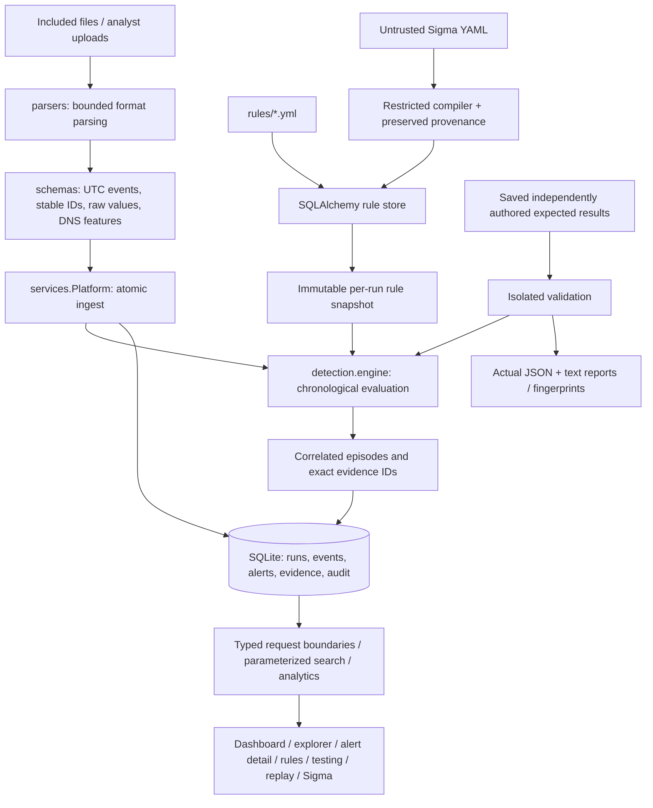

# Architecture

SentinelFlow is a single FastAPI application and a separately built React SPA.
The default local development supervisor runs Vite and Uvicorn on loopback.
The built SPA and vendored Swagger assets can also be served by FastAPI alone.
There are no runtime cloud dependencies or background security-platform calls.

## Boundaries

| Module | Responsibility |
|---|---|
| `core` | Configuration, input limits, safe decoding, access checks, receipt fingerprints |
| `schemas` | Strict normalized domain objects and API request types |
| `parsers` | JSON/JSONL/CSV, syslog authentication, explicit Windows-provider JSON |
| `detection` | Generic predicates, time windows/correlation, restricted Sigma translation |
| `services` | Ingest transactions, replay jobs, rule/status operations, isolated validation |
| `storage` | SQLAlchemy models and session/engine ownership |
| `api` | REST routes, request validation, local evidence/document endpoints |
| `frontend` | Accessible analyst workflows; no hardcoded operational metrics |
| `scripts` | Install/dev/validation/replay/reset/benchmark/source reproduction |

## Persistence and run isolation

An operational run owns a snapshot of the currently enabled rule definitions.
An observation is unique on `(run_id, event.id)`, and its storage ID incorporates
the run ID. Replaying the same file creates a fresh, separately identified run.
Duplicates inside a run must have identical normalized content, including raw
evidence; conflicting IDs reject the whole batch.

New batches are sorted and compared against the committed `(timestamp, ID)`
watermark. Late appends fail before a database mutation is committed. Evaluation
reconstructs the run in event-time order and deterministically upserts alerts,
preserving analyst status and exact evidence foreign keys. This is deliberately
simpler and slower than a production streaming engine.

Validation does not share operational correlation state or persist its alerts.
It reads checksum-verified fixtures and immutable bundled definitions, unless
the analyst explicitly selects current rule state. Expected outcomes are saved
independently of engine output.

Replay uses a small in-process worker pool. Progress and terminal states are
persisted; cancellation is cooperative. On restart, interrupted replay records
become explicit failures rather than hanging or reporting completion.

## Database portability

SQLAlchemy entities and JSON fields isolate storage from detection. SQLite
foreign keys, WAL, and busy timeouts are configured only on SQLite connections.
No detection relies on vendor-specific SQL or interpolated SQL text. PostgreSQL
would require a driver/configuration and migration/deployment work, not a new
detection engine. This version uses `metadata.create_all`, not managed migrations;
reset only the named demo database when developing schema changes.
