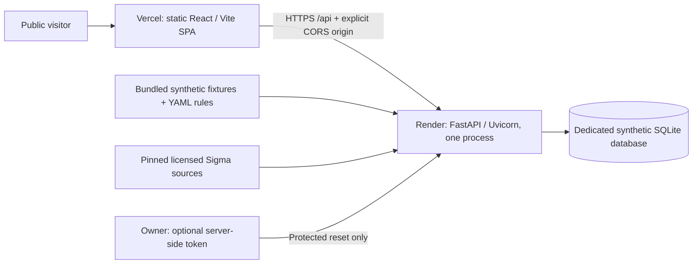

# Vercel + Render deployment runbook

This runbook prepares a **shared, synthetic-only portfolio demo**, not a production
SIEM. Deployment is a manual owner action. No GitHub push, provider login, account
creation, or Vercel/Render deployment is performed by the verification scripts.

The architecture stays a modular monolith: Vercel serves the React/Vite build;
one Render Python process owns FastAPI, replay workers, and SQLite.



## Public demo behavior

`SENTINEL_PUBLIC_DEMO=true` selects the restricted mode. The default remains the
original private/local mode; it is not silently made internet-accessible.

Microsoft, Windows/WEF and outbound notification integrations are private-only.
Keep `SENTINEL_ENABLED`, `GRAPH_ENABLED`, `WINDOWS_COLLECTOR_ENABLED` and
`NOTIFICATIONS_ENABLED` false. Public startup rejects enabled external flags;
owner tokens do not unlock integration administration or inbound collectors.
There is no tenant or webhook credential needed for this public demo.

| Public visitor can | Not available to public visitors |
|---|---|
| Inspect populated dashboard, events, alerts, raw evidence and pinned rules | Upload or paste telemetry |
| Search included synthetic telemetry | Import or modify the rule catalog |
| Replay included synthetic datasets at instant, realtime or 10x speed | Change alert statuses or enter investigation notes |
| Run isolated detection and rule-definition tests | Upload/edit/import arbitrary Sigma sources |
| Compile and test the two unchanged, licensed Sigma samples | Read developer logs, file inventory or local project documents through the API |
| Read API documentation and cancel shared active replays | Reset the database without an owner token |

The public catalog has **49 synthetic scenarios, including 14 benign scenarios**.
The full local catalog and validation retain **all 50 scenarios**. Only the
non-synthetic six-event OTRF interoperability dataset is excluded from public
catalog access, replay and validation; it is not deleted or relabeled synthetic.
The Sigma rule text is legitimate licensed public material, while its test events
are synthetic.

This is one shared workspace, not per-visitor data or tenant isolation. The seed
contains **56 events, seven alerts and seven enabled bundled rules**. At most
**20 runs** are stored: the protected seed and the latest 19 replays. Starting a
new replay prunes the oldest finished replay and its dependent evidence/audit
records. Active jobs are not pruned. Expired run links return a real not-found
response; select All runs or start another replay.

There are at most two active replay jobs and one public validation/compilation.
Capacity exhaustion returns 429, not a simulated success. Timed replay retains
its existing ten-minute limit. Public request bodies are capped at 128 KiB;
private mode retains the existing upload and parser limits.

## Environment variables

| Variable | Where | Value / meaning |
|---|---|---|
| `SENTINEL_PUBLIC_DEMO` | Render | `true` |
| `SENTINEL_DATABASE_URL` | Render | Free/ephemeral: `sqlite:///data/sentinelflow-public-demo.sqlite3` |
| `SENTINEL_ALLOWED_ORIGINS` | Render | Exact Vercel production origin; comma-separated additional approved origins |
| `SENTINEL_ALLOWED_HOSTS` | Backend, optional | Comma-separated hostnames only, not URLs, ports or wildcards |
| `SENTINEL_API_TOKEN` | Backend, optional | A new random owner token, used only for public reset; omit to disable remote reset |
| `PORT` | Render provides it | The production launcher reads it and binds `0.0.0.0`; defaults to 10000 locally |
| `RENDER_EXTERNAL_HOSTNAME` | Render provides it | Its hostname is added to allowed hosts and its HTTPS origin is allowed for Swagger |
| `PYTHON_VERSION` | Render | `3.13.15`, matching the release runtime pin |
| `VITE_API_BASE_URL` | Vercel build environment | Copy the actual Render service HTTPS origin, without credentials, query or fragment |

`VITE_API_BASE_URL=https://YOUR_RENDER_HOST` becomes
`https://YOUR_RENDER_HOST/api`. An optional `/api` suffix is accepted without
doubling it. Empty or `/api` is only for the local development proxy/combined
application. Vercel builds identified by `VERCEL=1` reject a missing, relative,
non-HTTPS or loopback backend value. Changing this Vite variable requires a new
frontend build/deployment; it is not a runtime server secret.

Never put an owner token or any other secret in a `VITE_` variable. Vite variables
are public browser build inputs. The public UI neither asks for nor stores an
owner token. Tokens supplied for reset do not unlock uploads or other restricted
features.

Use [.env.example](../.env.example) for the existing private workflow and
[.env.public-demo.example](../.env.public-demo.example) as a separate local
rehearsal reference. Do not overwrite an existing private `.env`.

## SQLite, startup and persistence

The application creates the configured parent directory and schema at runtime.
Relative SQLite paths resolve against the repository/application root, not the
caller's shell directory. Public mode requires the dedicated filename
`sentinelflow-public-demo.sqlite3`; private mode refuses that filename. Public
startup rejects populated unmarked databases, unrelated schemas and incompatible
public provenance. It does not turn an existing private database into a demo.

On first startup an application ownership marker is written, bundled rules are
loaded, and the fixed incident is evaluated through the real engine. A completed
seed is not re-created on every startup. An interrupted initial seed is recovered
only within the already claimed public database. Run IDs and creation times are
normal runtime values; event content, event timestamps and alert expectations are
deterministic.

**Render's default filesystem is ephemeral.** The included `render.yaml` uses a
free service without a disk. History can disappear on restart/redeploy and will
be seeded again if storage is lost. A process restart that retains its local
filesystem preserves history, but this does not mean Render's free filesystem
is persistent.

For persistent history, choose a paid Render web service and attach a disk:

| Setting | Exact value |
|---|---|
| Mount path | `/var/data` |
| Database URL | `sqlite:////var/data/sentinelflow-public-demo.sqlite3` |
| Process/instance count | One |

Only the mounted path persists. The disk is available at **runtime**, not during
the build; do not seed in a build command. Disk-backed services have scaling and
deployment limitations, including no zero-downtime deploys. Local volume tests
do not verify actual Render persistence. A disk is not an application backup or
restore system.

Keep a single Uvicorn worker. Replay state, capacity checks and validation limits
are in-process, and this application is not a distributed worker system. The
launcher deliberately ignores provider `WEB_CONCURRENCY` and does not trust
forwarded client-IP headers to grant loopback access.

## Part A: review and publish your repository

The following Git actions are **for the owner to perform later**. They have not
been executed as part of deployment preparation.

1. In this worktree, inspect `git status --short`, `git diff`, `git diff --check`,
   `git branch --show-current`, `git rev-parse HEAD`, and `git remote -v`.
2. Review the deployment report and secret-scan limitations. Review the
   pre-existing `docs/implementation-status.md` separately; do not accidentally
   discard it or treat it as a new deployment change.
3. Stage only reviewed source, tests, configuration and documentation. Include
   new files explicitly; `git add -p` alone does not stage untracked files.
   Do not stage `.env`, databases, virtual environments, node_modules or
   temporary verification artifacts.
4. Create your own commit, then inspect it. No deployment commit has been made
   for you.
5. Create/select your own GitHub repository and confirm its actual URL. If this
   repository has no remote, add that URL yourself. Do not blindly replace an
   existing remote.
6. Push the reviewed branch yourself, for example `git push -u origin HEAD`.
   Select **that branch** in both hosting projects. Do not assume `main` contains
   the implementation: the prepared worktree is on
   `mk23rd-sentinelflow-implementation`.

Do not publish the ignored `artifacts/` directory wholesale. It contains local
execution logs and temporary databases, not deployment inputs. The preserved
phase-one media and original saved receipts are historical evidence, not a
claim that the new version has already been deployed.

## Part B: Render backend

Create a **Web Service** from the repository and branch containing the reviewed
code. Native Python deployment is the recommended path; Docker is optional.

| Render field | Value |
|---|---|
| Root directory | Repository root (`.`), **not** `backend` |
| Runtime | Python 3 |
| Python version | Set `PYTHON_VERSION=3.13.15` |
| Build command | `python -m pip install --require-hashes -r requirements-runtime.lock` |
| Start command | `python scripts/serve.py` |
| Health check path | `/health` |
| Initial plan | Free/ephemeral, or deliberately choose a paid plan plus disk |
| Auto-deploy | Off while completing the manual setup |

Set `SENTINEL_PUBLIC_DEMO=true` and the SQLite URL from the table above.
Set `PYTHONPATH=backend` as in `render.yaml`. Production installs the runtime-only
lock, not pytest, linters or editable-build tooling. Offline Swagger assets are
included with the source, so this backend-only install needs no Node build.
Set `SENTINEL_ALLOWED_ORIGINS` to the frontend origin. If Vercel has not assigned
it yet, initially use `http://127.0.0.1:18875` (the narrow rehearsal origin),
not `*`; update it to the actual Vercel origin after Part C. Swagger on the
backend remains usable through Render's automatically allowed hostname/origin.

The supplied [render.yaml](../render.yaml) is an alternative Blueprint form of
these settings, not something already applied. It disables automatic deployment,
uses no paid disk by default and prompts for the allowed origins. No secrets or
future service URL are hard-coded in it.

Wait for startup and the health check. Copy the **actual HTTPS service URL**
from Render; this is your `BACKEND_URL` for subsequent steps. A successful
initialization returns public-demo health and a dashboard with 56 events and
seven alerts. No shell, manual SQL command or seed download is required.

For a custom backend domain, also add its hostname to `SENTINEL_ALLOWED_HOSTS`
and its HTTPS origin to `SENTINEL_ALLOWED_ORIGINS` if using same-origin Swagger.
Frontend custom domains belong in the origin list, not the backend host list.

## Part C: Vercel frontend

Create a Vercel project from the same repository and the branch you pushed.

| Vercel field | Value |
|---|---|
| Root Directory | `frontend` |
| Framework preset | Vite |
| Install command | `npm ci` |
| Build command | `npm run build` |
| Output Directory | `dist` |
| Environment variable | `VITE_API_BASE_URL` = actual Render HTTPS origin |
| Configuration file | `frontend/vercel.json` |

Set the variable for Production; set it for Preview only if that preview's
origin will also be explicitly allowed by the backend. Do not create wildcard
Vercel-domain CORS permissions. The SPA rewrite serves `index.html` for direct
navigation, including `/events`, `/alerts`, `/rules`, `/testing`, `/detections`
(an alias to `/testing`), `/replay`, `/sigma` and `/evidence`.

The production HTML's CSP permits connections only to self and the configured
API origin. Vercel headers supply frame denial, nosniff, no-referrer and the
header-only `frame-ancestors` policy. No development proxy is used in production.

Copy the actual Vercel production origin, such as the URL displayed under its
Domains settings. Update Render's `SENTINEL_ALLOWED_ORIGINS` to that exact origin,
without a path. Include any approved custom frontend origin separated by a
comma. Wait for the backend configuration restart, then reload the frontend.
Initial CORS errors before this final origin update are not a successful setup.

### Vercel Web Analytics

The frontend includes `@vercel/analytics` 2.0.1 through its **React** integration,
not `@vercel/analytics/next`. In the Vercel project, open **Analytics** and enable
Web Analytics if it is not already enabled. Deploy the branch containing this
integration, visit the production website, and navigate between pages. The
dashboard may take a short time to show visits; browser content blockers can
prevent collection. No analytics key or additional Render variable is needed.

The build enables collection only when Vercel supplies `VERCEL=1` and
`VERCEL_ENV=production`. The browser also waits for a successful backend health
response with `public_demo: true`. Local/private workspaces and Vercel Preview
builds do not load the collector. If the website still says **Local API
connected**, finish the public-demo configuration before expecting analytics.
Do not set the generated `VITE_WEB_ANALYTICS` flag yourself.

Only recognized public page types are counted. Dynamic event/alert/rule paths
are aggregated as `/:id`; query parameters, fragments and arbitrary paths are
excluded. Search/filter changes on the same page do not generate additional
page views. Custom events are rejected, and detailed or malformed referrers
prevent collection for that document. No log, entity, alert, form or token data
is submitted. Standard request metadata still reaches Vercel; see its
[Web Analytics privacy documentation](https://vercel.com/docs/analytics/privacy-policy).
The public **Demo data & limits** page discloses this behavior.

The script and collection endpoints use same-origin `/_vercel/insights/*`
paths, so the existing CSP does not need an external-domain exception. After
deployment, verify that `/_vercel/insights/script.js` returns JavaScript, not
the SPA HTML, and that page navigation produces successful
`/_vercel/insights/view` requests. Enabling the dashboard alone does not add the
React component to an older deployed build.

## Part D: post-deployment checks you must perform

Replace `BACKEND_URL` and `FRONTEND_URL` with the two URLs copied from the provider
dashboards. They are not known or invented in this repository.

```sh
BACKEND_URL='https://YOUR_ACTUAL_RENDER_HOST'
FRONTEND_URL='https://YOUR_ACTUAL_VERCEL_HOST'
curl --fail --silent --show-error "$BACKEND_URL/health"
curl --fail --silent --show-error "$BACKEND_URL/api/dashboard"
curl --fail --silent --show-error "$BACKEND_URL/openapi.json" -o /dev/null
curl --fail --silent --show-error -X OPTIONS \
  -H "Origin: $FRONTEND_URL" \
  -H 'Access-Control-Request-Method: POST' \
  -H 'Access-Control-Request-Headers: content-type' \
  -D - "$BACKEND_URL/api/detections/validate"
```

Health should be 200 with `public_demo: true` and `auth_required: false`.
The preflight's `Access-Control-Allow-Origin` must equal your frontend origin,
not `*`. Open `BACKEND_URL/docs`; `/redoc` is intentionally disabled.

In the actual deployed browser, verify all of the following:

- The shared-synthetic notice appears without a token prompt or upload control.
- Initial dashboard counts are 56 events and seven alerts before visitors replay.
- Event search, raw evidence, alert links and pinned rule definitions work.
- AUTH-001 replay processes 25 events and produces one high alert with 25 links.
- Its benign definition test produces zero alerts without adding operational data.
- PowerShell and DNS replay produce their expected indicator alerts.
- Both pinned Sigma sources compile and their positive/benign tests work;
  arbitrary source editing and import stay unavailable.
- Directly open and refresh each SPA route listed above, including an actual
  alert detail URL. Check a mobile viewport and keyboard navigation.
- Browser Network requests target the Render HTTPS `/api` origin. There are no
  mixed-content, CORS, critical console or unexplained API errors.
- Restart/redeploy the backend and verify the behavior appropriate to your
  chosen ephemeral or persistent storage. Test protected reset if configured.

These hosted checks remain the owner's responsibility. Local, Docker and
fresh-clone verification are not evidence of a completed external deployment.

## Operator reset

Public reset is not a visitor-facing button. Omit `SENTINEL_API_TOKEN` to keep
remote reset disabled. To enable it, generate a new random token and set it
**only in the backend's environment**. Do not reuse a GitHub/provider token.

From a trusted local checkout with dependencies installed, export that owner
token in your shell and run:

```sh
.venv/bin/python scripts/demo_reset.py \
  --api 'https://YOUR_ACTUAL_RENDER_HOST' --seed
unset SENTINEL_API_TOKEN
```

The CLI restores deterministic local fixture files before requesting reset.
The public endpoint requires the token, `confirmation: "RESET DEMO"` and
`seed: true`; it rejects active replays. It resets only the marked, dedicated
public database and restores the 56-event/seven-alert seed. It does not delete
source, deployment configuration or unrelated tables/files.

For a stopped **local** public instance, set the same public-mode/database
environment and use `scripts/demo_reset.py --offline --seed --api` with that
instance's exact local URL. Offline reset now honors environment configuration.
Never point a reset at the original live private instance, and never use
`--offline` to bypass a running instance.

## Reproduce the production-like checks locally

After installation and `make validate`, run from the repository root:

```sh
.venv/bin/python scripts/verify_deployment.py \
  --label local-native-1 --backend-port 18865 --frontend-port 18875

.venv/bin/python scripts/verify_deployment.py \
  --label local-docker-1 --docker --backend-port 18866 --frontend-port 18876
```

Use a **new label** for every attempt. An existing output directory or occupied
port is an error; the verifier never kills an existing service or reuses an old
database. It builds into `artifacts/deployment/LABEL/frontend`, not the original
live app's `frontend/dist`. It uses an independent database, an ephemeral owner
token held in memory, real browser requests, restart/persistence assertions and
protected reset. Reports, logs and new evidence screenshots remain under that
artifact directory. Failed attempts remain marked failed.

The Docker path checks the local `desktop-linux` Unix socket before building;
it refuses a remote Docker endpoint. It builds and runs `Dockerfile.backend` as
`linux/amd64` (emulated on an Apple-silicon host), uses a fresh named volume,
recreates the container against that volume, verifies UID 10001 and the actual
healthcheck, then removes only its own container and volume. The image is local;
it is not pushed. This script's Docker context is a local Docker Desktop
verification convention, not a Render runtime requirement.

`--keep-running` retains the verifier's app processes attached for inspection
after success. Interrupt that verifier to stop only its processes. The original
app instance and final phase-one screenshots/recording are not reset or replaced.

For a manual split-origin preview without the test harness:

```sh
# Terminal 1: a new, dedicated public database and explicit frontend origin.
SENTINEL_PUBLIC_DEMO=true \
SENTINEL_DATABASE_URL=sqlite:///data/sentinelflow-public-demo.sqlite3 \
SENTINEL_ALLOWED_HOSTS=127.0.0.1,localhost \
SENTINEL_ALLOWED_ORIGINS=http://127.0.0.1:18875 \
SENTINEL_API_TOKEN= PORT=18865 .venv/bin/python scripts/serve.py

# Terminal 2: build outside the original live frontend output.
VITE_API_BASE_URL=http://127.0.0.1:18865 \
  npm --prefix frontend run build -- --outDir ../artifacts/manual-public-frontend
VITE_API_BASE_URL=http://127.0.0.1:18865 \
  npm --prefix frontend run preview -- \
  --outDir ../artifacts/manual-public-frontend --port 18875
```

The existing full-stack `Dockerfile` and token-protected `docker-compose.yml`
remain a separate private/local option. They are not required for Vercel/Render.

## Reference and scope

- [Deployment checklist](deployment-checklist.md)
- [Deployment readiness report](deployment-readiness.md)
- [Security model](security.md), [API](api.md), [data provenance](data-provenance.md)
- [Render FastAPI](https://render.com/docs/deploy-fastapi)
- [Render web services / PORT](https://render.com/docs/web-services)
- [Render environment variables](https://render.com/docs/environment-variables)
- [Render persistent disks and limitations](https://render.com/docs/disks)
- [Render Blueprint schema](https://render.com/schema/render.yaml.json)
- [Vercel Vite / SPA routing](https://vercel.com/docs/frameworks/frontend/vite)

Initial dependency/browser installation and optional provider-schema downloads
need network access. Core operation and `make validate` remain offline after
installation. No Kubernetes, PostgreSQL migration, Redis, Celery, distributed
workers, SSO, full Sigma, EVTX or PCAP support was added.
