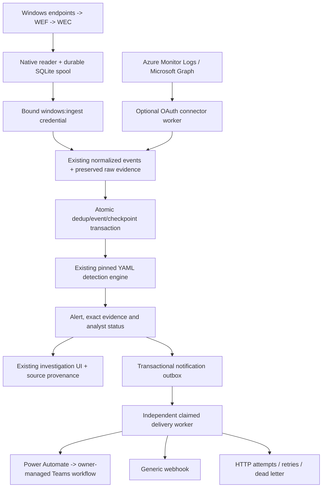

# SentinelFlow: integration implementation and validation report

**Status: implemented and verified locally; live Microsoft/domain/destination
verification remains unperformed.**

This report covers the 2,517-line Microsoft integrations and outbound
notifications phase. It supplements, rather than rewrites, the
[original implementation status](implementation-status.md) and the historical
[deployment readiness report](deployment-readiness.md).

The final comprehensive run completed on **2026-09-28 UTC** with **527 backend
tests and 141 frontend tests passing: 668 unique test cases, zero failures and
zero skips**. Real browser checks, native/container deployment rehearsals,
actual loopback HTTP delivery, and the actual collector CLI also passed.
The receipts are preserved under [results/integrations](results/integrations/).

No credentials were requested. No Azure/Microsoft 365 resource, Power Automate
flow, Teams channel or external webhook was created. Nothing was pushed,
merged, published or deployed. The previous uncommitted deployment work was
retained; this phase is also **uncommitted** on the assigned worktree branch.

## What is fully functional, and what is not verified

| Area | Implemented | Executed verification | Remaining / not verified |
|---|---|---|---|
| Original event pipeline and seven rules | Preserved | Full parser/detection/API/evidence/regression suite and original 33 browser checks | Enterprise detection coverage and false-positive rates are not claimed |
| Sentinel / Azure Monitor | Real client-credentials OAuth, fixed KQL profiles, incremental keyset queries, response parsing, checkpoint/dedup/retries | Actual local HTTP OAuth/query mocks, malformed/partial/error responses, ordering and restart | No live tenant/workspace authentication; optional tables need available data and stable source IDs |
| Graph / Entra | Real v1.0 sign-ins and directory-audit requests, OAuth, safe pagination, overlap/checkpoints | Actual local HTTP pagination and source-to-alert-to-receiver flows; error/throttle/security tests | No live Graph tenant/permission/licensing verification |
| Windows / AD / WEF | Real Wevtapi reader, durable bookmark/spool, authenticated batching and common Security/PowerShell/Sysmon mappings | Fixture/native-API harness; real collector CLI over TCP/HTTP, outage, server restart and duplicate acknowledgment | No actual Windows/WEC/AD host, event-channel ACL or GPO/subscription deployment tested |
| Power Automate-compatible destination | Secret-reference HTTPS POST, standardized payload, policy routing, queue/history | Actual local mock HTTP 2xx/retry/failure flows | No live Flow created or invoked; no Teams message delivered |
| Generic webhook | Independent destination, bearer/HMAC, idempotency, bounded transport | Local HTTP delivery and failures; header/signature, timestamp/tamper and malformed-header tests | No external receiver or real remote TLS endpoint tested |
| Administration UI | Connectors, query profiles, reference-only configuration, destination/policy CRUD, credentials and delivery detail | 19 new frontend cases and 28 real desktop/mobile browser checks | Not an enterprise multi-tenant administration console |
| Public synthetic deployment | External flags forbidden, mutations/collector blocked, read-only UI preserved | Native and actual Linux/amd64 container rehearsals; 27 public browser checks each | No Vercel/Render account deployment or public URL |

“Implemented” means a real code path exists, not that a tenant was connected.
“Delivered” means the configured receiver returned a successful HTTP acceptance,
not that a downstream Teams client rendered a message. Every demonstration is
explicitly labeled **Mock / offline**.

## Cohesive architecture

The existing FastAPI/Pydantic/SQLAlchemy/SQLite plus React/TypeScript/Vite modular
monolith remains intact. There are no new runtime package dependencies, brokers,
distributed caches, or microservices.



The detection engine was not replaced with Sentinel detections. Each connector
uses the existing normalized schema and a pinned rule run. HTTP notification
delivery occurs outside the ingestion transaction, so an unavailable receiver
does not remove alerts, lose evidence, or hold the core transaction on network I/O.

### State and correctness details

- Each profile has an independent checkpoint and bounded continuation. Failed
  pages do not advance it; Azure partial responses are failures even with HTTP 200.
- Source-scoped content-checked deduplication survives overlap and restart.
  Identical repeats are ignored; conflicting reused IDs fail the entire batch.
- Connector-only late arrivals are re-evaluated chronologically. Existing
  overlapping alert identities, status, evidence and notification identity are
  retained. Original manual/replay watermark behavior remains unchanged.
- A unique alert/destination key prevents duplicate outbox rows across policies
  and repeated requests. Queue claims use compare-and-swap and bounded expiry.
- Pending work resumes after restart, including demo work with every external
  integration flag false. A post-send crash remains at-least-once; receivers
  must deduplicate. Uncertain exhausted claims are never marked delivered.
- Windows bookmarks advance only with durable local spool insertion. Rows are
  deleted only after the API acknowledges the exact stored-plus-duplicate count.
  A full spool, invalid acknowledgment, or permanent failure retains data.
- Named-demo reset refuses active integrations/delivery, then clears
  checkpoint/dedup/counter/delivery state with core demo data. Disabled
  configuration and credential references remain. CLI reset also restores
  deterministic integration fixtures/schema before a destructive reset request.

## Database additions

`backend/app/storage/migrations.py` adopts the original schema as revision 1
and adds revision 2. Existing core rows are not rewritten. Repeated migration
is idempotent, and a future unknown revision is rejected before schema changes.

| Table | Purpose |
|---|---|
| `schema_revisions` | Recorded additive schema revisions |
| `connectors` | Configuration references, source/run binding, status and counters |
| `connector_checkpoints` | Independent per-profile state and next poll |
| `connector_events` | Durable source event/content dedup ledger |
| `notification_destinations` | Reference-only configuration and soft deletion |
| `notification_policies` | Routing independent from detection rules |
| `notification_deliveries` | Durable outbox, unique logical delivery, claims and terminal state |
| `notification_attempts` | Safe per-attempt timestamp/status/error history |
| `integration_credentials` | Environment reference, scopes, binding and revocation |
| `integration_leases` | Cooperative database ownership for workers/connectors |

This is a deliberately small SQLite-first additive migration mechanism, not a
complete downgrade framework, HA schema migration system, or PostgreSQL release.

## API and frontend changes

Both the existing root route style and `/api` aliases are supported. The complete
new endpoint inventory and request shapes are in [api.md](api.md).

| API family | Added behavior |
|---|---|
| `/integrations` | Actual status, counters, worker state and fixed profile catalog |
| `/integrations/connectors` | List/create; ID-based edit, enablement, real connection test and bounded poll |
| `/integrations/demo` | Deterministic source selection and actual local HTTP demonstration |
| `/ingest/windows` | Bound scoped credential, bounded batch, transactional ingestion and exact acknowledgment |
| `/integrations/credentials` | Reference-only registration, explicit scopes, rotation by environment and revocation |
| `/notifications/destinations` | Power Automate/generic CRUD, enable/disable and soft delete |
| `/notifications/policies` | Severity/rule/provider/MITRE/host/user/status routing and explicit replay opt-in |
| `/alerts/{id}/notify` | Idempotent explicit notification request |
| `/notifications/test` | Real queued test message, separate from a security incident |
| `/notifications/deliveries` | Paginated delivery state and per-ID safe payload/attempt details |

Alert detail adds `telemetry_sources` and independent `notifications`, preserving
the original rule-author `provenance` field. Provider/connector/table/channel,
ingestion time and supplied identity extensions live in event metadata.
Generic Windows System/Application events have distinct categories. The Wazuh
EventChannel/authentication-file subset now has an actual adapter; it was not
present in the inspected baseline despite being mentioned in the request's
description of existing features.

Frontend additions:

| File / component | User-visible function |
|---|---|
| `IntegrationsPage.tsx` | Disabled/default sources, counters, successful/error query state, offline scenario |
| `ConnectorForm.tsx` | Provider/mode, reference names, IDs, fixed profiles, intervals and page bounds |
| `CredentialSettings.tsx` | Scoped reference registration and revocation without a token-value field |
| `NotificationsPage.tsx` | Destinations, policies, actual history and per-delivery investigation |
| `DestinationForm.tsx` | Reference-backed endpoint/auth settings and bounded retry/timeout |
| `NotificationPolicies.tsx` | Exact routing filters, replay exclusion, independent toggles/deletion |
| `DeliveryTable.tsx` | Actual queue state, attempt counts, safe errors and delivery links |
| Existing alert/event components | Provider attribution beside evidence and independent delivery status |
| Existing shell/router | Integration/notification navigation, private/public behavior and responsive layout |

Loading, empty, success and error states are explicit. A queued test does not
immediately claim delivery. Configuration forms do not ask for secret values.
The new surfaces were exercised at 1440px and 390px with the actual backend,
including mobile navigation, configuration, delivery detail and alert evidence.

## Important implementation files

| Location | Responsibility |
|---|---|
| `backend/app/integrations/settings.py`, `schemas.py` | Optional flags, secret reference allowlist and bounded types |
| `transport.py` | HTTPS/SSRF protections, DNS pinning, absolute timeouts, response limits and safe errors |
| `connectors.py`, `profiles.py`, `normalize.py` | Actual Microsoft protocol adapters, supported mappings and honest missing fields |
| `stream.py`, `correlation.py` | Transactional source ingestion, dedup and late-event alert identity |
| `payloads.py`, `outbox.py`, `queue_worker.py`, `destinations.py` | Typed payload, routing, durable asynchronous retry/idempotency |
| `auth.py`, `management.py`, `operations.py`, `runtime.py` | Scoped access, audited management, operations and optional lifecycle |
| `demo.py` | Actual loopback HTTP OAuth/query/notification mocks |
| `collector.py`, `windows_native.py`, `parsers/windows_xml.py` | Durable spool, native Windows reader, bounded XML and original evidence |
| `parsers/wazuh.py`, existing Windows/pipeline parsers | Narrow Wazuh adapter and extended Windows mappings |
| `storage/integrations.py`, `storage/migrations.py` | Additive models/revisions/constraints |
| `api/integrations.py`, existing `platform.py`/security/main | Consistent APIs, transaction wiring, access and app lifecycle |
| `collector/windows/collect.py` | Actual foreground/one-shot/fixture collector CLI |
| `scripts/generate_integration_data.py` | Saved synthetic telemetry and generated notification schema |
| `scripts/validate_integrations.py`, `browser_integrations.mjs` | Reproducible local workflow validator and actual UI checks |
| `backend/tests/integrations/`, `frontend/tests/integrations.test.tsx` | Connector/collector/outbox/security/migration/UI regressions |

The existing package locks remain pinned; no new package was required.
Validation, source fingerprints and formatter/linter coverage now include the
collector. The comprehensive runner requires real integration test categories
and retires stale integration receipts before executing.

## Security controls implemented and exercised

Environment-backed references prevent database/frontend storage of client
secrets, bearer values and full Flow URLs. Registration validates scope/binding;
revocation and rotation are enforced on subsequent requests. Ambiguous token
values and invalid/revoked supplied credentials are rejected instead of falling
back to loopback ownership. Management does not accept automation scopes.

Outbound URLs reject credentials/fragments and prohibited networks by default.
DNS answers are checked together and the approved numeric address is pinned
while retaining TLS hostname verification. Metadata/link-local addresses,
redirects and proxy-environment use are denied. Internal HTTPS needs explicit
CIDR opt-in. Only explicit test mode permits loopback HTTP.

DNS concurrency/wait, absolute HTTP time, retry count and response size are
bounded. Provider response and notification response limits are independent.
HMAC uses exact body bytes and a timestamp window; malformed/non-ASCII headers
return false rather than crashing the verifier. Idempotency remains a separate
receiver responsibility.

Untrusted XML rejects DTD/entities. All logs remain inert. SQLAlchemy uses
parameters, raw evidence remains text in the UI, and error/history records do
not store credential values or upstream response bodies. Input/configuration
count limits and process-local rate limits constrain amplification.

This is implementation testing, not an independent penetration assessment.
There is no enterprise secret manager, immutable audit log, encrypted SQLite
spool, distributed DDoS control, tenant RBAC, or application-managed TLS server.
Private mode should not be exposed directly to untrusted networks.

## Exact executed results

The passing pre-change baseline was **351 backend + 122 frontend = 473 unique
tests**. This phase adds **176 backend and 19 frontend cases**. Final receipts
and command logs are linked from the [evidence index](results/integrations/README.md).

| Check | Actual final result |
|---|---|
| Full backend suite | **527 passed**, 0 failed, 0 skipped |
| Full frontend suite | **141 passed**, 0 failed, 0 skipped |
| Unique backend/frontend cases | **668 passed** |
| Connector-tagged backend subset | 96 passed |
| Notification-tagged backend subset | 28 passed |
| Security-tagged backend subset | 160 passed |
| End-to-end-tagged backend subset | 7 passed |
| Migration/persistence-tagged backend subset | 8 passed |
| Parser-tagged backend subset | 50 passed |
| Regression-tagged backend subset | 166 passed |
| Negative-tagged backend subset | 17 passed, including three provider-benign cases |
| Authored core detection scenarios | 50 passed, 0 failed |
| Core controlled-benign scenarios | 14/14 passed |
| Licensed Sigma compatibility | 4 passed |
| Backend coverage | 86.64% combined line/branch coverage |
| Ruff lint/format and strict MyPy | Passed |
| ESLint, Prettier, TypeScript and Vite production build | Passed |
| Locked Python consistency and deterministic fixture/schema checks | Passed |
| Existing analyst browser checks | 33 passed; no capture of original media |
| New integration browser checks | 28 passed; four new live screenshots |
| Native public deployment rehearsal | 10 checks + 27 desktop/mobile browser checks passed |
| Linux/amd64 Docker public rehearsal | 11 checks + 27 desktop/mobile browser checks passed |
| Private integrations inside actual Docker image | Three source flows passed with networking disabled except loopback; 62 events / 11 alerts / 11 receiver receipts |
| Actual collector CLI over local TCP/HTTP | Four checks passed: initial ingest, outage, restart/duplicate recovery, bookmark repeat |

Backend categories overlap. Browser/scenario/smoke counts are separate from
the 668 unique tests and are not summed into that total. Coverage is not
detection accuracy or a false-positive estimate. The backend run emits one
third-party Starlette/AnyIO deprecation warning; it is not a test failure.

### Exact local integration outcomes

| Source | Events | Rule counts | Accepted mock deliveries |
|---|---:|---|---:|
| Sentinel | 13 | AUTH-001: 1; IAM-001: 1 | 2 |
| Graph | 13 | AUTH-001: 1; IAM-001: 1 | 2 |
| Windows | 36 | AUTH-001, AUTH-002, PROC-001, PROC-002, IAM-001, DNS-001, NET-001: one each | 7 |

Repeated polls/demonstrations produced zero duplicate deliveries. Provider-benign
counterparts contain 3 Sentinel, 3 Graph and 4 Windows events: all produced zero
alerts and zero deliveries, with bundled rules enabled.

The additional real CLI check launched an isolated Uvicorn process, registered
a synthetic scoped collector credential, and ran the actual CLI executable.
It produced 36 events, seven alerts and seven mock deliveries. During a real
backend outage the CLI exited 2 with all 36 records retained. After server
restart it acknowledged 36 duplicates, emptied its durable spool and left the
alert/delivery counts unchanged. All task-owned smoke processes were stopped.
This was a fixture CLI test, not a live Windows-domain test.

### Actual measurements

The engine benchmark evaluated 5,600 events, 39,200 event-rule pairs and exactly
700 alerts on each of three iterations. Median detection duration was
**0.442448291 seconds**, or **12,656.85 events/second**. Parsing, storage,
notification and UI work are excluded from this engine-only measurement.

The independent complete local integration workflows measured:

| Workflow | Measured seconds | Events / second |
|---|---:|---:|
| Sentinel mock OAuth/query -> detection -> receiver | 0.059693 | 217.78 |
| Graph mock OAuth/query -> detection -> receiver | 0.039438 | 329.63 |
| Windows fixture normalization -> detection -> receiver | 0.048274 | 745.74 |

These small synthetic samples include local HTTP/SQLite/notification work and
are not a production throughput claim, cloud latency measurement, collector
fleet benchmark or long-running worker soak test. Host: macOS arm64,
Python 3.13.7, Node 20.19.2. The container rehearsal used a non-root
Linux/amd64 image under Docker Desktop; it is not Windows testing.

## Remaining limits and deliberate non-features

1. **Live certification remains:** Azure permissions/tables/retention, Graph
   consent/licensing, Windows/WEC channel permissions, actual Power Automate
   trigger authentication, Teams rendering and external webhook interoperability
   require owner-controlled environments. No live success is inferred.
2. **Finite connector runs:** default 10,000 events per run. Reaching capacity
   fails without checkpoint advancement; no automatic rollover/archival/retention
   discards data. New rule sets require a new pinned connector run.
3. **Provider coverage is a subset:** Azure keyset pagination requires a usable
   `_ItemId`, `Id` or `ReportId`; ambiguous keys fail closed. Syslog is the
   recognized authentication subset. CEF/Defender mappings cover selected
   fields/actions, not every vendor schema or national cloud endpoint.
4. **Cloud host absence is real:** Graph audits often lack a physical host.
   It remains null rather than an invented service name, which can prevent
   host-grouped IAM-001 from matching. The fixture contains an explicit host.
5. **Delayed/duplicate data has bounds:** overlap cannot recover logs older
   than its configured window/source retention. Semantic copies in different
   connectors/tables are not globally reconciled as the same event.
6. **Delivery is not exactly once:** a crash after send can retry. Receivers
   must deduplicate the key. There is no dead-letter requeue UI. Existing
   suppressed/dead-letter alert/destination records are not silently reset.
   In-flight sends can complete after destination disable/delete.
7. **Windows deployment is owner-managed:** no GPO/WEF/Sysmon/service
   installation, no full EVTX parser, no automatic destructive stale-bookmark
   recovery, and no tested live domain. Large event values remain bounded by
   the existing normalized schema; rejected data is retained, not truncated.
8. **Operational maturity is limited:** SQLite-first single-host operation,
   process-local limits, no HA/distributed worker proof, multi-tenant SSO/RBAC,
   production-scale soak, encrypted spool, managed backups or enterprise
   false-positive measurement.
9. **No new recording claim:** the original real six-minute MP4 and eight PNGs
   remain unchanged. Four new integration screenshots and a deterministic
   video-ready scenario are supplied; the old video does not show this phase.

There is no known implementation blocker for the specified local/mock scope.
The limits above are visible constraints and unperformed real-environment work,
not hidden “connected” states or simulated delivery.

## Reproduction and local handoff

Worktree:
`/Users/triplea/Documents/CyberProjects/copilot-worktrees/sentinelflow/mk23rd-urban-journey`

Branch: `mk23rd-sentinelflow-implementation`.
HEAD remains `b987e6d7526b9a643bf9813fe816ada21c706b55`; deployment and integration
changes are uncommitted. No push/merge/branch switch was performed.

```sh
make validate
# Equivalent without Make:
python3 scripts/manage.py validate

.venv/bin/python scripts/validate_integrations.py
.venv/bin/python scripts/generate_integration_data.py --check

# Owner-run local production rehearsals; choose new labels and unused ports.
.venv/bin/python scripts/verify_deployment.py \
  --label my-integrations-native --backend-port 18865 --frontend-port 18875
.venv/bin/python scripts/verify_deployment.py \
  --label my-integrations-docker --docker --backend-port 18866 --frontend-port 18876
```

The separately started current private preview is
**http://127.0.0.1:18881/integrations**, using
`data/sentinelflow-integrations-review.sqlite3`. It remains attached to this
session, not detached for persistence after the CLI exits. It includes scoped
browser-verification runs: use run-specific links rather than treating global
dashboard totals as a single fixture result.

The original **8765** application process was left running and responsive.
Use **18881** for the newly loaded integration backend; the original process was
not restarted into this phase. Port 5173 and unrelated services were untouched.
Temporary public rehearsal and collector smoke processes were cleaned up.

For tenant setup, exact environment variables, payload/HMAC semantics and a
Power Automate flow blueprint, use [integrations.md](integrations.md).
For WEC installation, spool recovery and fixture commands, use the
[collector runbook](../collector/windows/README.md). For a portfolio walkthrough:
show disabled defaults, run a source demo, inspect AUTH-001 and its exact raw
evidence, open delivery history/HTTP attempts, demonstrate a benign test, and
show the actual validation receipt. Never relabel a mock as live.

## Evidence integrity

All final source-bound receipts use:

`9db953ffd9fa343a3219d36051910f93151d32682381440091614d72823f14a2`

The baseline is intentionally historical. The
[manifest](results/integrations/manifest.json) records saved evidence bytes/hashes.
Original screenshot bytes match the committed Git objects. The original MP4
still has SHA-256:

`aa444d5de6e407cd1977cd41690fc972e3e92f6fa13ec854942f91af01366df5`

These checks establish local reproducibility and preservation, not authenticity
of an external Microsoft tenant or certification as a production SIEM.
