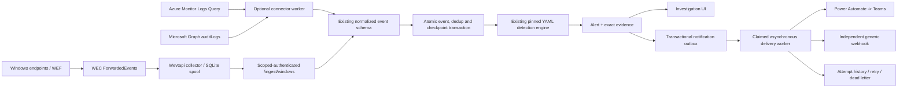

# Microsoft telemetry and notification integrations

This is an optional extension of the existing modular monolith. Microsoft
Sentinel, Microsoft Graph, and Windows are **telemetry providers**, not replacement
detection engines. SentinelFlow normalizes their events, runs its own pinned YAML
rules, stores alerts/evidence, and asynchronously routes selected alerts.
Power Automate is an outbound destination; Teams is reached through the owner's
flow, not through a separate Teams client in this application.

The connectors contain actual HTTP/OAuth or native Windows implementations.
Verification uses deterministic local HTTP servers, fixtures and a Windows API
harness. **No live Azure tenant, Graph tenant, Windows domain, Power Automate
flow, Teams channel or external webhook has been tested.** See the
[implementation report](integrations-implementation-report.md) for executed
results, not a claim of tenant connectivity.

## Run without credentials

Installation and `make dev` remain unchanged. External integrations default to
disabled, and the core application still works offline after installation.
In a private installation, open **Integrations**, choose a demo source, and
select **Run offline demonstration**.

| Demo source | Normalized events | Expected alerts | Real local receiver acknowledgments |
|---|---:|---|---:|
| Microsoft Sentinel | 13 | AUTH-001 and IAM-001 | 2 |
| Microsoft Graph | 13 | AUTH-001 and IAM-001 | 2 |
| Windows / AD / WEF | 36 | One of each of the seven bundled rules | 7 |

The Microsoft demos call an actual ephemeral loopback HTTP OAuth/query server.
The Windows UI demo exercises normalization and detection directly; the separate
collector test harness exercises spool and scoped-authenticated HTTP ingestion.
All three post notifications to an actual loopback receiver. A stored
`delivered` result means that receiver returned HTTP 2xx, **not that Teams
displayed anything**. Repeating a demo against its existing run does not duplicate
events, alerts, or notification deliveries. Intentionally disabled demo
connectors/destinations are not silently re-enabled.

```sh
.venv/bin/python scripts/generate_integration_data.py --check
.venv/bin/python scripts/validate_integrations.py
.venv/bin/python -m pytest -q backend/tests/integrations
npm --prefix frontend test -- tests/integrations.test.tsx
make validate
```

`validate_integrations.py` uses a temporary isolated database, cleans up its HTTP
servers, verifies receiver receipts and repeated-run stability, measures complete
workflow time, and writes `artifacts/integrations-validation.json`. Any mismatch
raises an error and produces a failing exit status. `make validate` also requires
executed connector, notification, migration and end-to-end test categories.
The [fixture manifest](../test-data/integrations/README.md) documents the benign
counterparts and expected results.

## Architecture and durability



SQLite revisions adopt the existing schema as version 1 and add integration
tables as version 2. Existing event, alert, evidence and rule rows are not
rewritten. Unknown future versions fail before additive DDL. This is a small
versioned, additive migration mechanism, not a complete Alembic downgrade system.

Each connector has one persistent run and a separate checkpoint per query profile.
The first ingested event pins the currently enabled detection rules. Rule edits
and toggles affect **new runs**, as before; use a new connector for a new pinned
rule set. A connector's source identity cannot be changed after it has a run.

An event is deduplicated by `(connector_id, normalized_event_id)` with a canonical
content hash. Identical repeats are ignored; a reused ID with changed content
fails the batch. Normalization preserves raw evidence and never executes it.
Connector event insertion, dedup ledger, engine output, evidence, outbox, and
successful checkpoint advancement share one transaction. Failed pages retain
their checkpoint and do not partially appear as imported.

Connector-only ingestion accepts late events and re-evaluates the bounded run
chronologically. Overlapping detections retain prior alert identity, analyst
status, historical evidence and already-created notification keys. Manual and
replay append watermarks remain strict. This is deliberately bounded
re-evaluation, not a production streaming engine or an exactly-once distributed
processing claim.

## Enable flags and credentials

| Server variable | Meaning / default |
|---|---|
| `SENTINEL_ENABLED` | Permit live Azure polling; `false` |
| `GRAPH_ENABLED` | Permit live Graph polling; `false` |
| `WINDOWS_COLLECTOR_ENABLED` | Permit live Windows batches; `false` |
| `NOTIFICATIONS_ENABLED` | Permit live outbound deliveries; `false` |
| `SENTINEL_INTEGRATION_WORKER` | Run the small background worker; `true` |
| `SENTINEL_INTEGRATION_LOCAL_TEST` | Explicitly permit loopback HTTP for tests; `false` |
| `SENTINEL_WEBHOOK_ALLOWED_NETWORKS` | Explicit CIDRs for internal HTTPS receivers; empty |
| `PUBLIC_BASE_URL` | HTTPS frontend base for investigation links; empty |

`PUBLIC_BASE_URL` is the frontend, not the backend API. Empty means the payload
contains no deep link; an absent deployment URL is not invented. Loopback HTTP
links are accepted only with explicit local-test mode. Public synthetic mode
refuses external enable flags and denies integration mutations server-side.

Secrets are read **only on the server** through environment references:
`SENTINEL_CLIENT_SECRET`, `GRAPH_CLIENT_SECRET`, or an allowlisted
`SENTINEL_INTEGRATION_[A-Z0-9_]{1,80}` variable. The database/API/UI stores the
reference, never the resolved value. A Flow trigger URL often contains a
credential in its query string; the entire URL must be treated as a secret.
Never use `VITE_` variables for credentials. None are included with the project.

On the first private startup, three disabled default connectors are created.
`SENTINEL_TENANT_ID`, `SENTINEL_CLIENT_ID`, `SENTINEL_WORKSPACE_ID`,
`SENTINEL_CLIENT_SECRET`, and `SENTINEL_POLL_INTERVAL_SECONDS` can initialize
the Sentinel connector. Graph uses the corresponding `GRAPH_*` variables,
without a workspace ID. Existing database configuration is deliberately not
overwritten by later environment changes: use the administration UI to edit its
IDs/reference and enablement. Restart after changing environment values/flags.

The optional worker resumes persisted enabled configuration and pending mock
deliveries after restart. Its status and safe last error are visible under
Integrations. Configuring an enabled destination starts delivery processing even
without a polling connector. Setting the worker flag false intentionally leaves
automatic work paused; it is used by deterministic tests.

### Scoped collector and automation credentials

The existing private analyst token/local ownership policy controls administration.
Register a separate random 32-256 character printable ASCII token in an
allowlisted server environment variable. The **Scoped integration credentials**
disclosure registers only its reference, name, selected scopes and optional
Windows connector binding.

The credential form also accepts an optional expiration in the operator's local
time, sent as a timezone-aware UTC instant. The backend rejects expired
credentials on every request; the owner UI shows **Expired**. Missing/legacy
`expires_at` is explicitly non-expiring. Expiry is not a login/session system
and does not add per-user or per-tenant authorization.

| Scope | Permitted operation |
|---|---|
| `alerts:read` | Read alerts and their evidence; not administration |
| `alerts:notify` | Explicitly request allowed alert notification delivery |
| `notifications:test` | Queue a destination test notification |
| `windows:ingest` | Push telemetry to the one bound Windows connector |

Collector credentials require a connector binding. They cannot toggle rules,
change analyst status, administer connectors or destinations, or ingest into
another connector. The owner token cannot substitute for `windows:ingest`.
Changing a reference's server value and restarting rotates the token; setting
its registered `enabled` flag false revokes it. Revocation works even after its
environment variable was removed. Ambiguous duplicate token values are denied.
An invalid/revoked supplied token never falls back to unauthenticated loopback
ownership.

## Microsoft Sentinel / Azure Monitor Logs

An owner must provision an application/service principal and workspace read
permissions separately. Nothing in this project creates Azure resources.
Use Microsoft's [API access guide][azure-auth] and workspace IAM documentation
to grant least-privilege query access to the intended tables. Its example uses a
workspace Reader assignment; custom narrower permissions can be appropriate.
Do not confuse the guide's delegated `Data.Read` example with a replacement for
the application's workspace RBAC assignment.

The connector implements OAuth v2 `client_credentials` against
`https://login.microsoftonline.com/{tenant}/oauth2/v2.0/token`, with
`https://api.loganalytics.io/.default` as scope. Queries POST to
`https://api.loganalytics.azure.com/v1/workspaces/{workspace}/query`.
Access tokens exist in memory only, are reused within a poll, and are refreshed
according to their expiry. Authentication errors are explicit; no interactive
login or silent credential substitution occurs.

### Fixed query profiles

| Profile | Table | Normalized content |
|---|---|---|
| `signin_logs` | SigninLogs | Sign-in result, user, IP, device when present |
| `directory_audit` | AuditLogs | Directory actions, initiator, targets and group |
| `windows_security` | SecurityEvent | Windows Security event mapping |
| `syslog` | Syslog | Recognized authentication syslog messages |
| `common_security` | CommonSecurityLog | Selected normalized connection fields |
| `azure_activity` | AzureActivity | Management activity and caller |
| `defender_device_events` | DeviceEvents | Generic device event / recognized DNS response |
| `defender_process` | DeviceProcessEvents | Process, parent and command-line fields |
| `defender_network` | DeviceNetworkEvents | Addresses, ports and protocol |
| `defender_logon` | DeviceLogonEvents | Logon result and account |

Only sign-ins and directory audit are selected by default. Owners explicitly
select available profiles and intervals; arbitrary user-supplied KQL is rejected.
Missing tables and permission failures are visible per profile without blocking
successful independent profiles. A table being listed is **not** evidence that
the owner's workspace has it, that every vendor-specific field is mapped, or
that the table has been live-tested.

Azure returns `tables -> columns -> rows`. The parser validates row widths,
column names, timestamps and page order. An HTTP 200 `PartialError` is still
failure. The Logs Query API does not supply Graph next links; SentinelFlow
implements fixed KQL **keyset queries**, ordered by UTC event time and a stable
hashed source key, requesting one extra row to determine continuation.

For safe ordering this implementation requires `_ItemId`, `Id`, or `ReportId`.
The key also includes device and event time. Missing native identifiers or
ambiguous equal keys are rejected, not silently skipped. Some workspaces/tables
do not expose a usable identifier: those profiles need an explicit future mapping
before use. The narrow Syslog profile rejects unrecognized message formats
rather than calling arbitrary text an authentication event.

Each poll has a 60-second provider budget, 1-500 rows/page, and 1-10 pages/profile.
Defaults are 200 rows and five pages. Saved continuation resumes on the next
poll instead of advancing past unread rows. Default lookback is 900 seconds,
overlap 120 seconds, interval 60 seconds. Limits are respectively 60-86,400,
0-3,600 and 30-86,400 seconds. Delays older than the configured overlap and the
source's retention are not recovered automatically.

## Microsoft Graph / Entra

Use a separate application credential and the Graph **application**
`AuditLog.Read.All` permission with administrator consent. Broader permissions
are not required just to read the two supported resources. Tenant licensing,
retention, audit availability, and permissions remain owner prerequisites;
conditional-access details can require additional permissions.

The OAuth scope is `https://graph.microsoft.com/.default`. Supported v1.0
resources are `/auditLogs/signIns` (`signins`) and
`/auditLogs/directoryAudits` (`directory_audits`). Each uses an event-time range,
a bounded `$top`, and validated `@odata.nextLink` continuation.

A next link must retain the configured scheme, authority and exact resource
path, with no embedded credentials or fragment. Cycles and oversized links are
rejected. Continuation state survives restart; demo-only loopback URLs are
rebound to the new local mock port. Live URLs are never rewritten. Rows may be
newest-first; ingestion sorts them before evaluating event-time windows.

Sign-in error `0` maps to success, `50053` to lockout, and other numeric errors to
failure. Audit actions map known group/user changes; unknown actions remain
directory audit events, not fabricated privilege alerts. Application/service
names are not invented physical hosts. Cloud events lacking a host preserve
`host.name=null`; this can prevent host-grouped bundled rules such as IAM-001
from matching. Synthetic IAM fixtures explicitly contain a device detail. This
is an honest compatibility limit, not Entra-wide privilege detection coverage.

## Windows / AD / WEF

The supported path is Windows endpoints -> Windows Event Forwarding -> Windows
Event Collector -> `ForwardedEvents` -> local SentinelFlow collector ->
scoped-authenticated API. The collector is a real `wevtapi` reader using
`EvtQuery`, `EvtNext`, `EvtSeek`, XML rendering and durable bookmarks. It never
spawns PowerShell, executes log content, or contacts a domain controller itself.

See [collector installation and recovery](../collector/windows/README.md).
Supported channels are ForwardedEvents, Security, PowerShell Operational,
Sysmon Operational, System and Application. Security IDs include 4624, 4625,
4740, 4720, 4722, 4725, 4726, 4728, 4732, 4756, 4729, 4733, 4757, 4672 and 4688.
PowerShell 4104 and Sysmon 1/3/22 are mapped. Generic System/Application records
are not misclassified as authentication or Sysmon process events.

An actual user name is preferred; a PowerShell event containing only the
Windows security SID uses that supplied SID as its identity identifier. Domain
and SID are also retained in metadata when supplied. A physical host is never
substituted with the WEC server name. XML-derived records retain the original
XML alongside normalized Event/System/EventData fields. DTD/entities are rejected.

The spool commits an event and its bookmark together before acknowledging local
collection. The API's exact stored-plus-duplicate count is required before spool
deletion. Network failures/restarts preserve rows; permanent errors and invalid
acknowledgments block them for explicit operator recovery. Batch size is at most
200, encoded body at most 500 KiB, API body at most 512 KiB, spool at most 100,000
rows. A full spool stops reading rather than discarding telemetry. Transient
sends retry with backoff up to ten attempts; `--retry-blocked` permits another
operator-requested attempt. Leases are renewed between channel reads and cannot
be released by an expired owner.

## Notification destinations and routing

Create a **Power Automate** or **Generic webhook** destination under Notifications.
New destinations are disabled; live destinations require an environment-backed
HTTPS URL, the server enable flag and explicit destination enablement. Edit,
enable/disable, confirmed delete, and **Send test** operate through real APIs.
Deletion is soft: history remains and unsent work is suppressed. It does not
change or remove the security alert.

Routing policies select destinations and any combination of severity, rule IDs,
source providers, ATT&CK technique IDs, hosts, users and alert statuses. Populated
dimensions are ANDed; values within a dimension are ORed. Empty lists match any
value, except statuses must explicitly list allowed states (default `new`).
Multiple policies matching the same alert/destination produce one delivery.
Replays are excluded unless explicitly opted in. Validation uses an isolated
engine and never emits operational notifications.

Automatic routing occurs when the alert is first created. Later analyst status
changes do not silently send another message. The explicit alert notify API
can request a destination that has not previously been scheduled. Existing
delivered, suppressed or dead-letter records are returned rather than requeued.
A stable unique `(alert_id,destination_id)`
key prevents repeated notify requests or repeated polling from adding duplicates.
Receiver-side idempotency remains required for uncertain network outcomes.

### Delivery payload and receiver contract

The stable version is `1.0`, with `event` equal to `security_alert` or
`notification_test`. It contains an alert summary, severity, rule, status,
timestamp, ATT&CK IDs, source provenance/entities, detection description,
optional investigation URL, and explicit `mock`. Raw telemetry and credentials
are not included. A test has `alert:null`, not a synthetic security incident.

Use the generated
[JSON Schema](../test-data/integrations/notification.schema.json).
Header `Idempotency-Key` identifies an individual alert/destination delivery.
Return 2xx only after accepting or durably deduplicating the request. Do not
interpret acceptance as proof a downstream channel message was rendered.

Authentication options are an environment-backed bearer value or HMAC-SHA256.
For HMAC the sender signs ASCII timestamp, a literal period, and the **exact
canonical JSON body bytes**, in that order, using SHA256. Headers are
`X-SentinelFlow-Timestamp` and `X-SentinelFlow-Signature: sha256=<hex>`.
Use `verify_signature` in `app.integrations.destinations` as a receiver example;
it compares in constant time and defaults to a 300-second clock tolerance.
Verify before parsing/acting, then deduplicate the idempotency key. Correct
signature checking does not by itself prevent replay within the clock window.

Power Automate trigger URLs commonly contain their own signature query
parameter. That URL is stored only in the environment; generic webhook query
strings are rejected. Bearer/HMAC headers do not automatically make an arbitrary
Flow validate them: use the trigger's supported authentication or an explicitly
configured verification step/gateway.

### Power Automate flow blueprint (owner action, not created here)

1. Choose an HTTP request trigger compatible with the tenant's licensing and
   authentication policy. Restrict who can invoke it; keep its complete URL secret.
2. Validate the request/authentication and version against the linked schema.
   If custom HMAC is selected, supply a real validating receiver/gateway rather
   than assuming Power Automate natively validates this application's signature.
3. Persist/check `Idempotency-Key` before downstream side effects.
4. Branch on `notification_test` versus `security_alert`. A test should be
   clearly labeled and must not look like an incident.
5. For alerts, compose a plain-text or safely escaped Teams message containing
   severity/title, rule, source, user/host, ATT&CK IDs and investigation link.
   Treat all telemetry-derived values as untrusted. Do not execute commands or
   arbitrary links taken from raw log content.
6. Return 2xx for accepted/duplicate work, a permanent 4xx for invalid input, or
   429/5xx for retryable failures. Use Retry-After when appropriate.

No flow export, Teams message, Microsoft resource or live delivery receipt has
been fabricated. Tenant-dependent HTTP/Teams connector licensing is not an
offline dependency of SentinelFlow.

### Retry, failure and shutdown

The queue stores `pending`, `processing`, `delivered`, `failed`, `suppressed`
and `dead_letter`. Claims use database compare-and-swap and bounded expiry.
Network failures, 429 and 5xx retry; permanent 4xx dead-letter immediately.
`Retry-After` supports seconds/HTTP dates, capped at one hour. Otherwise retries
use exponential backoff with deterministic jitter. Destinations allow 1-5 attempts,
1-15 second timeout and 1-300 second initial delay. Default attempts are three.
Attempt number, timestamp, HTTP status and safe error code are retained.
Response bodies, headers and credential values are not persisted.

External I/O occurs after the alert/outbox transaction commits. A receiver
outage cannot block core alert storage on a network call or destroy its evidence.
Pending work survives application restart. If the process dies after sending
but before recording success, delivery is **at least once**; the receiver must
deduplicate. At the bounded attempt limit an expired uncertain claim becomes
`delivery_uncertain`/dead-letter, never a fabricated success. This version
provides history inspection but no dead-letter requeue UI.
Disabling/deleting a destination prevents future claims and suppresses waiting
work; a network request already in flight can still finish and be recorded.

## Security and operational boundaries

Outbound HTTPS uses certificate/hostname verification, approved numeric-IP
connection pinning and original-host SNI. DNS results are validated together;
mixed permitted/prohibited answers are rejected. No redirects or proxy
environment settings are followed. Loopback, private, reserved, multicast,
IPv6-mapped private and metadata/link-local destinations are denied by default.
Explicit internal CIDR opt-in permits HTTPS only; metadata/link-local addresses
remain denied. DNS slots, DNS wait, absolute HTTP duration and response bytes
are bounded. Provider responses are limited to 1 MiB, webhook responses to 8 KiB.

Management, connection tests, manual sends and collector batches have bounded
process-local rate limits; destinations/connectors/policies/credentials have
count and input limits. These are not distributed DDoS controls. Structured
audit entries record configuration, credential, poll, ingestion, notification
and status actions without secrets. SQLite and the spool are not encrypted:
secure filesystem ACLs, backups and log access remain operator responsibilities.

Runs remain capped by `SENTINEL_MAX_EVENTS` (default 10,000). A full connector
run fails without advancing its checkpoint; no automatic archive, retention or
rollover silently discards context. Archive/export externally and create a new
connector deliberately. There is no production-scale throughput, multi-tenant
RBAC, HA/failover or real-domain compatibility claim.

Reset remains restricted to the named demo database. Disable connectors and
destinations and wait for in-flight delivery before resetting. Reset clears
demo checkpoint/dedup/counter/delivery state along with core events/alerts,
but retains disabled configuration and credential references. It refuses active
integrations instead of deleting data while a worker is using it.

## References and what they establish

These references were consulted for protocol/setup compatibility, not as
evidence of live testing. Provider behavior, retention and licensing can change.

- [Azure Monitor Logs API access and authentication][azure-auth]
- [Azure query response format][azure-response]
- [Microsoft Graph sign-ins][graph-signins]
- [Microsoft Graph directory audits][graph-audits]
- [Windows Event Forwarding architecture][wef]
- [Windows EvtSeek/bookmark semantics][evtseek]

[azure-auth]: https://learn.microsoft.com/en-us/azure/azure-monitor/logs/api/access-api
[azure-response]: https://learn.microsoft.com/en-us/azure/azure-monitor/logs/api/response-format
[graph-signins]: https://learn.microsoft.com/en-us/graph/api/signin-list?view=graph-rest-1.0
[graph-audits]: https://learn.microsoft.com/en-us/graph/api/directoryaudit-list?view=graph-rest-1.0
[wef]: https://learn.microsoft.com/en-us/windows/security/operating-system-security/device-management/use-windows-event-forwarding-to-assist-in-intrusion-detection
[evtseek]: https://learn.microsoft.com/en-us/windows/win32/api/winevt/nf-winevt-evtseek
